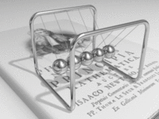
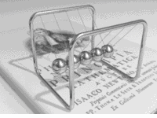

# Brief

Add a process bar to GIF image. Enjoy yourself. XD

# Usage

```bash
python3 gif_process_bar.py /path/to/original.gif /path/to/new.gif "#background_color_hex" "#bar_color_hex"
```

# Demo

```bash
python3 gif_process_bar.py testfiles/pendulum.gif testfiles/new.gif "#FFFFFF" "#111111"
```

From:



To:


